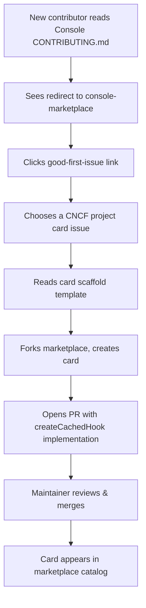

# Console-Marketplace Contributor Funnel

*Turning CONTRIBUTING.md redirects into productive contributions*

## The Challenge

The [KubeStellar Console CONTRIBUTING.md](../contributing/documentation/contributing-inc.md) explicitly redirects new CNCF project card contributions to **`kubestellar/console-marketplace`** — currently listing 153+ community card presets.

This is the **right architectural decision**. The marketplace is the designated landing zone for community-driven cards. However, without its own contributor onboarding infrastructure, that redirect is a **dead end**.

## The Gap

When a contributor arrives at `kubestellar/console-marketplace` for the first time, they need:

1. ✅ **Clear `good-first-issue` labeled issues** — what can a newcomer contribute?
2. ✅ **CONTRIBUTING.md or onboarding doc** in the marketplace repo
3. ✅ **Card template / scaffold** showing the `createCachedHook` pattern
4. ✅ **Issue labels matching Hacktoberfest criteria** for October discoverability

Without these, contributors land at console-marketplace and bounce.

## Why This Matters Now

- `CONTRIBUTING.md` was recently updated (PR #18161) and is **actively directing contributors** to console-marketplace
- **Hacktoberfest 2026** is ~4 months away — setting up `good-first-issue` labels now gives time to accumulate enough labeled issues before October
- **153+ card presets** signals active use, but PRs to add more are gated on discoverability
- The console ships **300+ cards** — marketplace is the primary growth vector for expanding that further

## Proposed Solution

### 1. Seed `good-first-issue` Batch

Open **5–10 issues** in `console-marketplace` for specific missing CNCF project cards:

| Issue Title | Card | Difficulty | Hacktoberfest-ready? |
|------------|------|------------|---------------------|
| Add K3s dashboard card | K3s status monitoring | Easy | ✅ |
| Add Keptn card | Keptn metrics | Medium | ✅ |
| Add Kro card | Kro operator status | Easy | ✅ |
| Add Crossplane card | Crossplane resources | Medium | ✅ |
| Add Dapr card | Dapr sidecar health | Easy | ✅ |
| Add KubeVirt card | VM workload monitoring | Hard | ✅ |
| Add OpenTelemetry card | OTEL collector status | Medium | ✅ |
| Add Backstage card | Backstage plugin health | Medium | ✅ |

**Label strategy**:
- `good-first-issue` (required for GitHub's "first-time contributor" filter)
- `hacktoberfest` (required for Hacktoberfest discoverability)
- `help wanted` (signals community-friendly)
- `card-request` (marketplace-specific label)

### 2. Add Card Scaffold Template

Create `templates/card-scaffold.tsx` in console-marketplace showing the **`createCachedHook` factory pattern**:

```tsx
import { createCachedHook } from '@/lib/cache'

// 1. Define your data types
interface MyProjectStatus {
  healthy: boolean
  version: string
  count: number
}

// 2. Initial data (before first fetch)
const INITIAL_DATA: MyProjectStatus = {
  healthy: false,
  version: 'unknown',
  count: 0,
}

// 3. Demo data (fallback when no API keys / demo mode)
const DEMO_DATA: MyProjectStatus = {
  healthy: true,
  version: 'v1.2.3',
  count: 42,
}

// 4. Fetcher function
async function fetchMyProjectStatus(): Promise<MyProjectStatus> {
  const resp = await fetch('/api/my-project/status', {
    signal: AbortSignal.timeout(10000), // 10s timeout
  })
  if (!resp.ok) throw new Error(`HTTP ${resp.status}`)
  return resp.json()
}

// 5. Export the hook (one line!)
export const useCachedMyProject = createCachedHook<MyProjectStatus>({
  key: 'my-project-status',
  initialData: INITIAL_DATA,
  demoData: DEMO_DATA,
  fetcher: fetchMyProjectStatus,
})
```

**Documentation**:
- Add `templates/README.md` explaining the scaffold
- Link from marketplace CONTRIBUTING.md
- Include common patterns: multi-cluster queries, demo data generation, error handling

### 3. Update Console CONTRIBUTING.md

Add a **direct link** to the marketplace's `good-first-issue` filter:

```markdown
### Adding CNCF Project Cards

New CNCF project card contributions should be submitted to **[console-marketplace](https://github.com/kubestellar/console-marketplace)**.

👉 **Start here**: [Good first issues in console-marketplace](https://github.com/kubestellar/console-marketplace/issues?q=is%3Aissue+is%3Aopen+label%3A%22good+first+issue%22)
```

### 4. Post in CNCF Slack

Announce the contributor funnel in:
- `#contributors` — CNCF-wide contributor channel
- `#kubestellar` — KubeStellar community channel
- `#kubestellar-dev` — KubeStellar developer channel

**Sample announcement**:
```
🚀 New contributor opportunity: KubeStellar Console Marketplace

We've seeded a batch of `good-first-issue` labeled card requests for CNCF projects like K3s, Keptn, Crossplane, and Dapr.

All issues are Hacktoberfest-ready 🎃 and include a card scaffold template showing the `createCachedHook` pattern.

Start here: https://github.com/kubestellar/console-marketplace/issues?q=is%3Aissue+is%3Aopen+label%3A%22good+first+issue%22

Questions? Drop them in #kubestellar 👋
```

## Contributor Onboarding Flow



## Success Metrics

Track the contributor funnel:

| Metric | Baseline (2026-06) | Target (2026-10) |
|--------|-------------------|------------------|
| `good-first-issue` count | 0 | 10+ |
| PRs from first-time contributors | 0/month | 5/month |
| Marketplace card count | 153 | 200+ |
| Hacktoberfest PRs | 0 | 20+ |
| CNCF Slack mentions | ~2/month | 10+/month |

## Maintenance

**Monthly review** (first Tuesday):
1. Refresh `good-first-issue` labels (close completed, add new)
2. Update card scaffold template based on console changes
3. Post monthly summary in CNCF Slack #kubestellar

**Quarterly deep dive** (January, April, July, October):
1. Audit marketplace CONTRIBUTING.md vs console CONTRIBUTING.md
2. Review Hacktoberfest label compliance
3. Sync with console maintainers on new card patterns

## Risks & Mitigations

| Risk | Mitigation |
|------|-----------|
| Low-quality Hacktoberfest spam PRs | Require issue assignment before PR; use Hacktoberfest spam filter labels |
| Card scaffold becomes outdated | Pin scaffold to console release tags; add CI check for template drift |
| Marketplace maintainer bandwidth | Auto-assign to rotating maintainer queue; use Copilot code review agent |

## Next Actions

1. ✅ **Open seed batch** of 5–10 `good-first-issue` issues in console-marketplace
2. ✅ **Add card scaffold template** to `templates/card-scaffold.tsx`
3. ✅ **Update console CONTRIBUTING.md** with direct link to marketplace issues
4. ✅ **Post CNCF Slack announcement** in #contributors, #kubestellar
5. ⏳ **Track metrics monthly** and report in community meetings

---

## Example Issue Template

**Title**: Add K3s dashboard card

**Body**:
```markdown
## Card Request

Add a dashboard card for **K3s** (lightweight Kubernetes distribution).

### What to Monitor
- K3s server status (healthy/unhealthy)
- Agent node count
- Version string
- Optional: embedded etcd status

### API Endpoint
`/api/k3s/status` (to be implemented in console backend)

### Demo Data
```json
{
  "healthy": true,
  "version": "v1.28.5+k3s1",
  "nodes": 3,
  "etcdHealthy": true
}
```

### Scaffold
See [templates/card-scaffold.tsx](../templates/card-scaffold.tsx) for the `createCachedHook` pattern.

### Labels
- `good-first-issue`
- `hacktoberfest`
- `help wanted`
- `card-request`

### Estimated Effort
~2 hours (includes backend endpoint + frontend hook)
```

---

*Established June 2026 | Contributor growth initiative*
