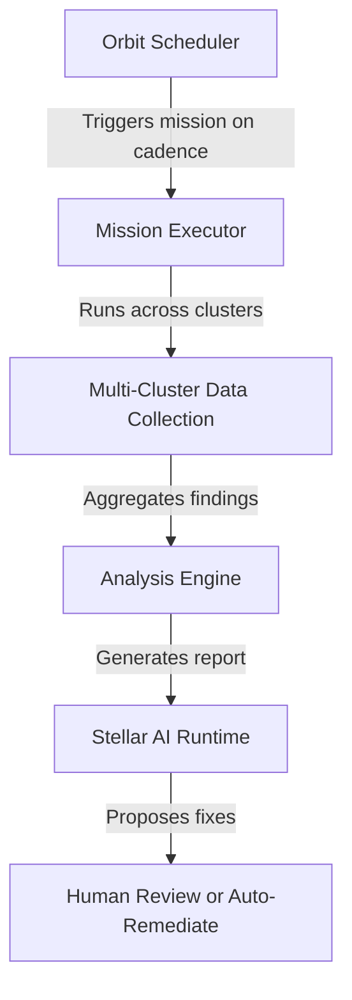

# Orbit Recurring Missions: Scheduled Proactive Multi-Cluster Maintenance

## Overview

**Orbit** is KubeStellar Console's subsystem for **recurring automated missions** — scheduled operational tasks that run on a cadence (weekly, daily, nightly) to maintain cluster health across a multi-cluster fleet. Unlike one-time missions (install, debug, fix), Orbit missions are **proactive and scheduled**: they detect drift, validate compliance, and catch issues *before* they cause incidents.

## Why Orbit?

Most Kubernetes observability tools are **reactive** — they alert when something breaks. Orbit is **proactive**: it runs scheduled missions that catch version drift, certificate expiry, and backup failures before they impact production.

### Key Differentiators

| Traditional Monitoring | Orbit Recurring Missions |
|------------------------|--------------------------|
| Reactive alerts after failure | Proactive checks before failure |
| Manual maintenance schedules | Automated recurring missions |
| Dashboard-only visibility | AI-driven remediation via Stellar |
| Single-cluster focus | Multi-cluster fleet awareness |

## Available Orbit Missions

KubeStellar Console ships with the following Orbit missions in the `console-kb` knowledge base:

### 1. **Orbit Health Check** (`orbit-health-check`)
**Type**: `maintain`  
**Cadence**: Weekly  
**What it monitors**:
- Crash-looping containers across all namespaces
- Pending pods (scheduling failures, resource constraints)
- Services with no healthy endpoints
- Persistent volume claim issues

**Output**: Multi-cluster health report with actionable remediation steps

### 2. **Orbit Version Drift** (`orbit-version-drift`)
**Type**: `maintain`  
**Cadence**: Weekly  
**What it monitors**:
- Outdated Helm charts (comparing deployed vs. latest upstream)
- Pinned-but-stale image tags (`:latest`, `:stable`, specific versions)
- Inconsistent versions across namespaces (same app, different versions)
- CVE-vulnerable image versions

**Output**: Version drift report with upgrade recommendations

### 3. **Orbit Certificate Rotation** (`orbit-cert-rotation`)
**Type**: `maintain`  
**Cadence**: Scheduled (configurable)  
**What it monitors**:
- TLS certificate expiry across the cluster fleet
- Certificate rotation status
- Certificate chain validation
- Ingress/service mesh cert health

**Output**: Certificate expiry timeline with rotation priorities

### 4. **Orbit Backup Verification** (`orbit-backup-verification`)
**Type**: `maintain`  
**Cadence**: Scheduled (configurable)  
**What it monitors**:
- Velero backup job status
- Backup completeness (all namespaces included)
- Backup restore validation (test restore to temporary namespace)
- Backup storage health (S3/GCS bucket access)

**Output**: Backup health scorecard with failed backup details

### 5. **Orbit Resource Quota Check** (`orbit-resource-quota`)
**Type**: `maintain`  
**Cadence**: Scheduled (configurable)  
**What it monitors**:
- Resource quota utilization per namespace
- Impending quota exhaustion (>80% usage)
- Pod count limits
- PVC storage limits

**Output**: Resource quota report with capacity planning recommendations

## How Orbit Works



1. **Scheduler**: Triggers Orbit missions based on configured cadence (cron-like)
2. **Executor**: Runs the mission across all registered clusters in parallel
3. **Collector**: Gathers data (pods, services, Helm releases, certificates, etc.)
4. **Analyzer**: Identifies drift, failures, expiring resources
5. **Reporter**: Surfaces findings in the dashboard + optional Stellar AI remediation

## Integration with Stellar Runtime

Orbit missions integrate with **Stellar** (KubeStellar Console's persistent AI runtime) for automated remediation:

- **Orbit detects** → certificate expiring in 7 days
- **Stellar proposes** → automated cert-manager renewal mission
- **Human approves** → Stellar executes renewal across affected clusters
- **Orbit validates** → next weekly check confirms renewal success

This creates a closed-loop operational intelligence system:

```
Orbit (detection) → Stellar (AI-driven remediation) → Dashboard (observability)
```

## Configuration

Orbit missions are defined in the `console-kb` repository as JSON mission files. Example:

```json
{
  "id": "orbit-health-check",
  "title": "Orbit: Weekly Multi-Cluster Health Check",
  "category": "maintain",
  "tags": ["orbit", "recurring", "health", "proactive"],
  "cadence": "0 2 * * 1",
  "description": "Automated weekly health scan across all clusters",
  "steps": [
    "Scan all namespaces for crash-looping pods",
    "Check for pending pods with scheduling errors",
    "Validate service endpoint health",
    "Generate multi-cluster health report"
  ]
}
```

### Cadence Format

Orbit uses **cron syntax** for scheduling:

| Cadence | Cron Expression | Example |
|---------|----------------|---------|
| Weekly (Monday 2am) | `0 2 * * 1` | Health checks |
| Daily (midnight) | `0 0 * * *` | Version drift |
| Every 6 hours | `0 */6 * * *` | Certificate monitoring |
| Monthly (1st, 3am) | `0 3 1 * *` | Backup verification |

## Use Cases

### SRE Teams
- **"Set it and forget it" maintenance**: Schedule weekly health checks to catch issues before on-call escalation
- **Certificate disaster prevention**: Automated cert expiry monitoring prevents the #1 cause of production outages
- **Drift detection**: Identify version inconsistencies across dev/staging/prod clusters

### Platform Engineering Teams
- **Capacity planning**: Resource quota checks provide early warning of namespace exhaustion
- **Backup compliance**: Automated backup verification ensures disaster recovery readiness
- **Golden path enforcement**: Version drift detection keeps all teams on approved tool versions

### Multi-Cluster Operators
- **Fleet-wide visibility**: Single report covering health, versions, certs across 10+ clusters
- **Consistency validation**: Detect when one cluster diverges from fleet baseline
- **Proactive remediation**: Catch issues in non-prod clusters before they reach production

## Comparison with Other Tools

| Tool | Orbit Advantage |
|------|----------------|
| **Prometheus/Grafana** | Orbit is proactive (scheduled checks) vs. reactive (alert after failure) |
| **ArgoCD** | Orbit checks runtime state (live pods, certs) vs. declarative config drift |
| **Velero** | Orbit *validates* backups are restorable, not just created |
| **Kyverno** | Orbit operates at the operational layer (detect drift) vs. admission control |

Orbit complements these tools — it's not a replacement. Use Prometheus for reactive alerts, ArgoCD for GitOps, and Orbit for scheduled proactive maintenance.

## Roadmap

Upcoming Orbit missions in development:

- **Orbit Security Scan**: Weekly RBAC audit + pod security standard compliance
- **Orbit Cost Optimization**: Identify over-provisioned workloads and idle resources
- **Orbit Compliance Check**: Validate SOC2/HIPAA/PCI-DSS controls across clusters
- **Orbit Network Policy Audit**: Detect network policy gaps and unrestricted egress

## Getting Started

### Prerequisites
- KubeStellar Console v0.3+
- Console-KB knowledge base installed
- At least one registered cluster

### Enable Orbit

1. **Install console-kb** (if not already installed):
   ```bash
   kubectl apply -f https://raw.githubusercontent.com/kubestellar/console-kb/main/install.yaml
   ```

2. **Navigate to Missions** in the KubeStellar Console dashboard

3. **Browse Orbit missions** (filter by `orbit` tag)

4. **Configure cadence** (optional — defaults to weekly)

5. **Enable mission**: Click "Enable Orbit" to start scheduled runs

### View Results

Orbit mission results appear in:
- **Dashboard → Missions** tab (historical results)
- **Alerts** (if Orbit detects critical issues)
- **Stellar Missions** (if AI remediation is enabled)

## Community & Support

- **GitHub Issues**: [kubestellar/console/issues](https://github.com/kubestellar/console/issues)
- **CNCF Slack**: `#kubestellar` channel
- **Docs**: [console.kubestellar.io/docs/console/orbit-recurring-missions](https://console.kubestellar.io/docs/console/orbit-recurring-missions)

## Contributing

Orbit missions are open source! Contribute new missions via the [console-kb repository](https://github.com/kubestellar/console-kb).

Mission contribution guidelines:
1. Missions must be **idempotent** (safe to run repeatedly)
2. Include **cadence recommendation** in mission metadata
3. Provide **multi-cluster aggregation logic** (not single-cluster only)
4. Document **expected output format** for Stellar integration

---

**Orbit: From reactive alerts to proactive operations.**
